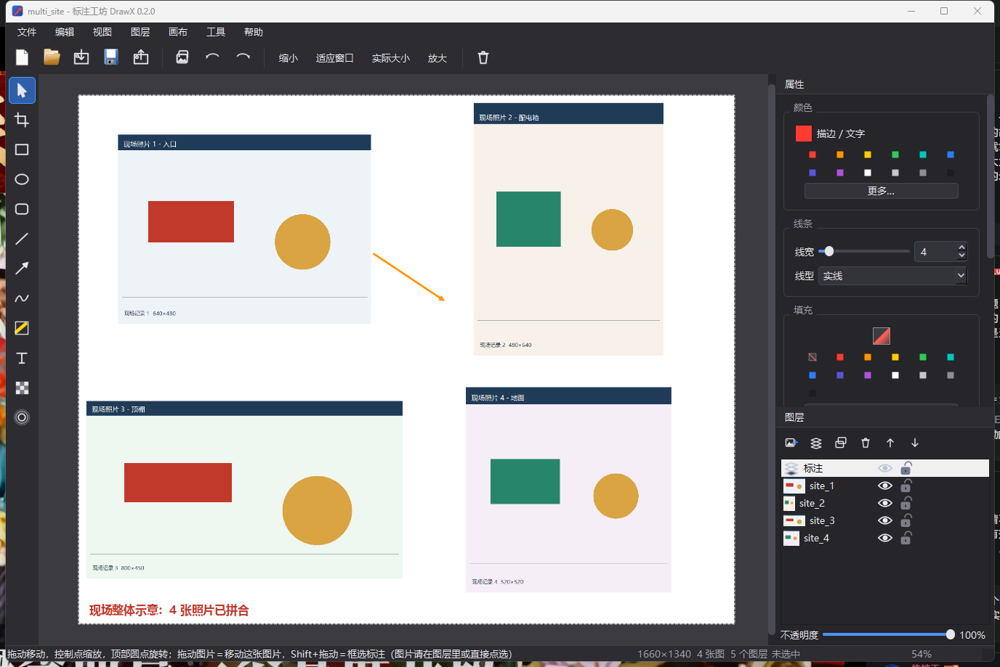
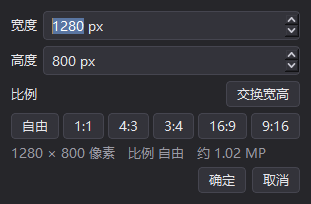

# 标注工坊 · DrawX

**轻量图片标注工具**：一张画布上可以放多张图片（每张各是一个图片图层），标注永远是**矢量对象**，
整个文档存成一个 `.drawx` 工程文件随时接着改；在 Windows 上打包成**免安装单文件 exe**，双击即用。



> **一句话定位**：微信截图的编辑手感 + Photoshop 的「工程文件可再编辑」+ 多张照片拼成一张图，
> 但没有 Photoshop 的重量。

`Windows 10/11`　`Python 3.11 + PySide6`　`单文件 exe 41 MB`　`438 项自动化测试`

📄 **文档**：[项目状态（一页交接单）](docs/项目状态.md) · [设计方案](docs/设计方案.md) · [踩坑记录（已修复问题的存档）](docs/踩坑记录.md)

## 它解决什么问题

| 工具 | 标注对象能再编辑 | 有工程文件 | 多图拼合 | 轻 |
|---|---|---|---|---|
| Windows 画图 | ✗ 落笔即变像素，只能往后撤销 | ✗ | ✗ | ✓ |
| 微信截图 / Snipaste / PixPin | ✗ 导出即扁平 | ✗ | ✗ | ✓ |
| Photoshop | ✓ | ✓ | ✓ | ✗ 太重 |
| **本工具** | **✓ 随时选中、拖动、改样式** | **✓ `.drawx`** | **✓ 多张图片各是一个图层** | **✓ 单文件 exe** |

画完的箭头、文字、矩形随时能重新选中和修改；每张照片也能移动、缩放、旋转、非破坏裁剪。

**典型场景**：把现场拍的十几张照片一起拖进来 → 「画布 → 自动排列图片图层」铺成网格 →
逐张调整位置 / 裁剪 / 顺序 → 在上面圈画标注 → 导出成一张完整的现场图。

## 快速开始

**用打包好的 exe**：双击 `DrawX.exe` 即可，无需安装、无需 Python 环境。
图片（可多张）或 `.drawx` 文件也能直接拖到窗口里或拖到 exe 上打开。

> 仓库只收录源码：41 MB 的 exe 与全部产物都在 `.gitignore` 里，exe 需要自己打包（见下）。

**从源码跑 / 自己打包**：

```powershell
python -m venv .venv
.venv\Scripts\python.exe -m pip install -r requirements.txt

.venv\Scripts\python.exe run.py            # 开发运行（可跟一个图片或 .drawx 路径）

pwsh -File packaging\build.ps1             # 打包：产物在 build\dist\DrawX.exe
pwsh -File packaging\build.ps1 -Onedir     # 目录版：启动更快，便于排查
```

## 功能

### 多图拼合（本工具的核心场景）

- `Ctrl+I` **一次可选多张**图片，每张各成一个图片图层；拖进窗口的图片也是**全部**收下；`Ctrl+V` 粘贴的截图同样作为新图层加入
- 每张图片都能：拖动移动、8 控制点缩放（Shift 等比）、顶部圆点旋转、**非破坏裁剪**（选中图片后按 `C` 框选，随时能改回来）
- 新图片自动摆在已有图片右边，不覆盖也不重叠；画布装不下就自动长大
- **自动排列图片图层**：按网格统一缩放排布并重设画布，最适合「多张现场照片汇成一张」
- 选中图片时属性面板只显示图片相关的项（原图尺寸、图层不透明度、重置裁剪、原始大小），
  不会亮着一堆改了也没用的样式控件

### 画布

| 菜单项 | 说明 |
|---|---|
| 画布大小… | **一个对话框同时设宽高**，带 `1:1 / 4:3 / 3:4 / 16:9 / 9:16` 比例预设、「交换宽高」和实时像素提示；越界会警告 |
| 画布适应内容 | `Ctrl+Shift+F` 或 `F9`，把内容收进画布并去掉多余空白 |
| 自动排列图片图层 | 按网格统一缩放排布（多图拼合后常用） |
| 背景色 | 白 / 浅灰 / 深灰 |



### 图层面板（右下角）

| 操作 | 怎么做 |
|---|---|
| 选中 / 切换当前图层 | 单击图层行；新标注进当前图层 |
| 显示 / 隐藏 | 点行尾的**眼睛** |
| 锁定 / 解锁 | 点行尾的**锁**（锁定后画布上选不中、拖不动它，防误操作；面板里的改名/删层/调不透明度照常） |
| 调整顺序 | 直接拖动图层行，或用面板的 ▲▼ 按钮、图层菜单的上移/下移/置顶/置底 |
| 改名 | 双击图层名（或 `F2`） |
| 复制 / 删除图层 | 面板按钮或 `Ctrl+J` / 图层菜单 |
| 图层不透明度 | 面板底部的滑块（拖动中实时预览，松手才落一条撤销记录） |
| 重置图片裁剪 | 图层菜单「重置图片裁剪」 |

图层顺序从上到下就是**绘制顺序从高到低**：上面的图层盖住下面的。
标注图层默认排在图片图层上面（照片在底、标注在上）。

### 标注工具

左侧工具栏，括号里是快捷键。

| 工具 | 说明 |
|---|---|
| 选择 (V) | 单击选中；**在图片上拖动＝移动这张图片**；`Shift+拖动`＝框选标注；Ctrl 点选切换 |
| 裁剪 (C) | **非破坏**：选中一张图片时裁的是这张图片（会临时显示整幅原图，裁掉的部分随时能重新框回来）；没选图片时裁的是导出范围 |
| 矩形 (R) / 椭圆 (O) / 圆角矩形 (U) | Shift 正方形，Alt 从中心画 |
| 直线 (L) / 箭头 (A) | 端点可拖，Shift 锁 45° 倍数，箭头可设起点 / 终点 / 两端 |
| 画笔 (P) / 高亮 (H) | 自由绘制，轨迹自动平滑 |
| 文字 (T) | 就地输入（支持中文输入法），可改字体 / 字号 / 粗斜体 / 颜色，宽度自适应换行 |
| 马赛克 (B) / 模糊 (M) | **非破坏**：区域随时能移动、缩放、调强度；采样的是它下面所有图片图层的合成结果 |

### 对象编辑（本工具的核心价值）

- 8 个控制点缩放，顶部圆点旋转（Shift 每 15° 吸附）
- `Alt+拖动` 复制对象；方向键微调 1px，`Shift+方向键` 10px
- 双击文字随时重新编辑
- 属性面板上下文相关：有选中就改选中对象，没有就改「新对象默认样式」
- 复制 / 剪切 / 粘贴标注对象（`Ctrl+C/X/V`），可跨文档粘贴
- **对象级撤销重做**：图层增删排序、显隐、锁定、不透明度、图片移动缩放裁剪，全都能撤销

### 文件与导出

- 工程文件 `.drawx` = zip 容器（`project.json` + 每张图片的原图 + 缩略图），单文件便于发送，换机器不丢图
- **拖入即用**：图片（可多张）和 `.drawx` 都能直接拖进窗口
- **快速复制为图片**：工具栏按钮 / 文件菜单 / `Ctrl+Alt+C`；**没有选中对象时按 `Ctrl+C` 也是这个效果**，
  复制的是**拼合后的整幅画布**（PNG，同时提供位图与 `image/png` 两种剪贴板格式）
- 导出 PNG / JPG / WebP / BMP，**1x / 2x / 3x / 4x**；导出范围 = 当前裁剪框
- 导出走矢量重绘：2x 导出时文字与线条依然锐利，不是插值放大

## 快捷键

| 分组 | 快捷键 |
|---|---|
| 工具 | `V` 选择　`C` 裁剪　`R` 矩形　`O` 椭圆　`U` 圆角矩形　`L` 直线　`A` 箭头　`P` 画笔　`H` 高亮　`T` 文字　`B` 马赛克　`M` 模糊 |
| 编辑 | `Ctrl+Z` / `Ctrl+Y` 撤销重做　`Ctrl+A` 全选　`Ctrl+D` 取消选择　`Del` 删除　`Ctrl+C/X/V` 复制剪切粘贴 |
| 微调 | 方向键 1px，`Shift+方向键` 10px；`Shift` 加选 / 等比 / 锁 45°；`Alt` 从中心画 / 拖动复制 |
| 图层 | `Ctrl+I` 添加图片图层　`Ctrl+Shift+N` 新建标注图层　`Ctrl+J` 复制图层　`Ctrl+[` `Ctrl+]` 下移 / 上移一层　`F2` 重命名 |
| 画布 | `F9` 画布适应内容　选中图片后 `C` = 裁这张图片 |
| 视图 | `Ctrl+滚轮` 缩放　空格拖动 / 中键拖动 平移　`Ctrl+0` 适应窗口　`Ctrl+1` 实际大小　`Ctrl+=` `Ctrl+-` 放大缩小 |
| 文件 | `Ctrl+N` 新建　`Ctrl+O` 打开　`Ctrl+S` 保存　`F12` 另存为　`Ctrl+E` 导出　`Ctrl+Alt+C` 复制为图片 |

程序内 `F1` 有同一份说明。

> ⚠️ **注意**：部分中文输入法会拦截 `Ctrl+Shift` 组合键，所以「另存为」额外提供 `F12`、
> 「新建标注图层」额外提供 `Ctrl+Alt+N`、「删除图层」额外提供 `Ctrl+Alt+D`、
> 「复制为图片」额外提供 `Ctrl+Alt+C`。每个 `Ctrl+Shift` 快捷键都有一条 `Ctrl+Alt`（或 `F` 键）保底。

## 设计要点

1. **一张画布 = 一列图层**。图层有两种：图片图层（承载一张带变换的位图）与标注图层（承载任意多个矢量对象）。
   `Document.layers` **顶层在前**，绘制顺序是它的反序。
2. **对象的 z 值是派生值**：只由「图层顺序 + 图层内追加顺序」决定，由 `CanvasScene.reflow_z()` 统一分配；
   撤销 / 重做之后会自动重排一次，所以快照里的旧 z 永远不会把对象偷偷搬到别的图层上。
3. **图片不是背景**：它就是一个普通的场景图元，所以「选中→移动→缩放→裁剪」全部白拿现成的手柄与撤销机制；
   代价是命中测试要分两套（标注永远优先于图片）。
4. **编辑态装饰画在 `QGraphicsView.drawForeground()`**，而导出是直接渲染 `QGraphicsScene`，
   所以选中框、控制点、裁剪框天然不会混进导出图。
5. **导出与屏幕缩放完全解耦**：按裁剪区域 × 倍率离屏渲染，矢量重绘。
6. **撤销是对象级快照**（不是像素回滚），内存开销极小，任何历史状态都能追溯；所有修改强制走 `QUndoCommand`。
7. **马赛克 / 模糊是非破坏区域对象**：渲染时把它下面所有图片图层合成成一张位图再像素化，源图一个字节都不改。

## 工程文件格式

```
photo.drawx  (zip)
├── project.json            # 文档模型（UTF-8，缩进 2 空格，可人工排查）
├── assets/img-xxxx.png     # 各图片图层的**原始**位图（无损内嵌，按 assetId 分开存）
└── thumbnail.png           # 缩略图
```

`project.json` 结构与逐字段说明见 [docs/设计方案.md](docs/设计方案.md) 的 3.1 / 3.2 两节。要点：

- `layers[]` 里每项带 `type`（`image` / `annotation`）、`visible`、`locked`、`opacity` 与 `objects[]`
- 读取时**保留未知字段**（顶层与图层级都保留）并原样写回，配合版本号与迁移链保证向后兼容
- **v1 工程文件能直接打开**：原来那张「背景位图」会自动升级成最上面的一个图片图层，显示效果一模一样

## 目录结构

<details>
<summary>展开看每个文件的职责</summary>

```
run.py                      开发期入口
src/drawx/
├── app.py                  入口：QApplication、深色主题、高 DPI、命令行参数
├── const.py                常量、调色板、默认样式
├── selftest.py             打包自检（DrawX.exe --selftest 报告.json）
├── items/                  对象（QGraphicsItem 子类）
│   ├── base.py             样式、控制点、序列化契约、图层不透明度/显隐合成
│   ├── image_item.py       图片对象（原图 + 非破坏保留区 + 裁剪编辑态）
│   ├── shapes.py           矩形 / 椭圆 / 圆角矩形 / 直线 / 箭头
│   ├── freehand.py         画笔 / 高亮
│   ├── text.py             文字（QGraphicsTextItem，白拿输入法支持）
│   ├── mosaic.py           马赛克 / 模糊（非破坏，采样下方图层）
│   └── factory.py          类型字符串 <-> 类
├── model/                  纯数据层
│   ├── layers.py           图层模型（图片/标注、显隐、锁定、不透明度、顺序约定）
│   ├── document.py         画布、图层列表、非破坏裁剪框
│   ├── commands.py         撤销命令（对象快照式 + 图层命令 + 复合命令）
│   └── serialize.py        .drawx 读写（v2 多资源 + v1 迁移）
├── render/
│   ├── exporter.py         导出（矢量重绘）
│   ├── backdrop.py         把图片图层合成成位图（马赛克/模糊采样用）
│   └── effects.py          像素化 / 高斯模糊 / EXIF
├── tools/                  交互层
│   ├── select_tool.py      选择 / 框选 / 移动 / 缩放 / 旋转 / 拖动图片
│   ├── crop_tool.py        双模式非破坏裁剪（画布 / 图片图层）
│   └── draw_tools.py       各绘制工具
└── ui/
    ├── canvas_view.py      缩放平移、画布与装饰绘制、命中测试、事件分发
    ├── canvas_scene.py     场景、撤销栈、图层执行者、z 重排
    ├── layer_panel.py      图层面板（缩略图/显隐/锁定/排序/不透明度）
    ├── property_panel.py   上下文属性面板（含图片图层组）
    ├── main_window.py      菜单、工具栏、画布与图层菜单、文件与剪贴板
    ├── dialogs.py          画布大小 / 导出设置等对话框（已中文化）
    └── icons.py            用 QPainter 现画的矢量图标（零资源文件）
packaging/                  打包（产物全部落在 build\，不入库）
├── build.ps1               PyInstaller 打包脚本（--onefile / --onedir）
├── make_icon.py            生成 app.ico（画法与运行期共用 ui/appicon.py）
└── app.ico / app.png       exe 图标资源
tests/                      离屏自动化测试（见下）
devtools/                   零插件 GUI 操控与截图验收工具（见下）
```

</details>

## 开发与测试

测试全部可以离屏跑完，共 **438 项断言**：

```powershell
$env:QT_QPA_PLATFORM="offscreen"
.venv\Scripts\python.exe tests\smoke_test.py           #  63 项：序列化 / 交互数学 / 存取 / 导出
.venv\Scripts\python.exe tests\interaction_test.py     #  50 项：各工具、属性面板与 3 条纪律断言
.venv\Scripts\python.exe tests\layer_test.py           # 166 项：图层、多图、裁剪、画布尺寸对话框、v1 迁移
.venv\Scripts\python.exe tests\ui_test.py              #  41 项：图标/样式、拖放、剪贴板、中文化、QSS 与快捷键纪律
.venv\Scripts\python.exe tests\icon_test.py            #  90 项：全部 28 个图标的尺寸/重心/缩放 + 箭头约束
.venv\Scripts\python.exe tests\arrow_test.py           #  17 项：箭头渲染像素级校验
.venv\Scripts\python.exe tests\blank_canvas_test.py    #  11 项：空白画布必须正常渲染
Remove-Item Env:\QT_QPA_PLATFORM
```

以下**必须**用真实平台（离屏平台的剪贴板是空实现，写进去会直接崩）：

```powershell
.venv\Scripts\python.exe tests\clipboard_real_test.py copy
.venv\Scripts\python.exe tests\clipboard_real_test.py read   # 另一个进程读回，证明真的进了系统剪贴板
.venv\Scripts\python.exe tests\render_shot.py                # 真实平台外观截图

# 真实 GUI 端到端：驱动窗口改图层，再读工程文件核对每个动作都落盘了（19 项）
.venv\Scripts\python.exe devtools\verify_gui_layers.py

# 打包产物自检（会短暂弹窗，结果写文件）
build\dist\DrawX.exe --selftest build\smoke\selftest_exe.json

# 文档体检：README 与 docs/ 的相对链接是否可达、表格列数是否一致
.venv\Scripts\python.exe devtools\check_docs.py
```

`devtools/screen_agent.py` 是一个**零插件**的 Windows GUI 操控工具（纯 ctypes + Pillow）。
它不移动物理鼠标就能点击 / 拖动 / 输入——鼠标键盘走 `PostMessage` 窗口消息，
只有截图和 `--real` 按键时会短暂把目标窗口提到前台：

```powershell
$A = ".venv\Scripts\python.exe devtools\screen_agent.py"

& $A list                                                     # 列出可见窗口
& $A shot  --window 标注工坊 --out step1.png                   # 只截这个窗口（含标题栏）
& $A click --window 标注工坊 --x 300 --y 300                   # 坐标 = 截图里量到的位置
& $A drag  --window 标注工坊 --x1 300 --y1 300 --x2 600 --y2 400
& $A key   --window 标注工坊 --real ctrl+s                     # 组合键必须加 --real
& $A hover --window 标注工坊 --x 600 --y 400                   # 报告鼠标光标形状
& $A crop  --in step1.png --out zoom.png --box 0,0,300,200 --scale 2
& $A run   devtools/scripts/gui_layers_edit.json               # 一串步骤一次跑完
```

配套的验收脚本（输出统一写在 `build\` 下，不入库）：

| 脚本 | 用途 |
|---|---|
| `devtools/verify_gui_layers.py` | **真实 GUI 端到端**：重新生成示例 → 改图层 → 读回 `project.json` 逐项核对（19 项） |
| `devtools/multi_image_demo.py` | 生成「4 张现场照片拼成一张图」的示例工程与导出图 |
| `devtools/dialog_shot.py` | 把提示框 / 输入框渲染成图片，验收文案（模态框也能截，真实平台中文才准） |
| `devtools/icon_sheet.py` · `icon_variants.py` · `icon_metrics.py` | 图标对照图 / 参数并排比较 / 墨迹重心测量（改图标必看） |
| `devtools/drag_source.py` · `make_sample.py` | 可被拖出去的真实 OLE 拖放源窗口 / 生成「像截图」的测试素材 |
| `devtools/check_docs.py` | README 与 `docs/` 的结构体检：相对链接可达、表格列数一致、围栏配对 |
| `tests/probe_platform.py` | 最小探针：确认当前平台能建窗口、系统字体可用 |

大量 bug 是把它真跑起来点出来的（图标缩成 1 像素、拖放被 viewport 吃掉、输入法吞掉 `Ctrl+Shift`……），
逐条的**现象 / 根因 / 修复**收在 [docs/踩坑记录.md](docs/踩坑记录.md)；
**改代码前该注意什么**看 [docs/设计方案.md 第 11 节「已知坑、注意事项」](docs/设计方案.md#11-已知坑注意事项)。

## 已知限制

**刻意的取舍**（改起来不难，只是当前这么定）：

- **图片上拖动＝移动图片**，框选标注要 `Shift+拖动`（或者点图层行整层选中）；
  这是为了让「拖进来就能拖走照片」成立而做的取舍
- **多选支持移动、删除、改样式、层级，不支持整体缩放**（单个对象 / 图片可自由拉伸）
- 图片的缩放是等比拉伸到目标尺寸，不做「保持宽高比」自动吸附
- 马赛克 / 模糊只采样**图片图层**的合成结果，不采样它下面的标注
  （要遮挡标注请把马赛克对象放到标注上面）
- 撤销栈上限 100 步

**还没做**：自动保存 / 崩溃恢复、最近文件列表、`.drawx` 文件关联、组合（`Ctrl+G`）、
贴图、取色器、尺寸标注。

**明确指出不做**：图层混合模式、滤镜库、蒙版、钢笔、PSD 兼容 —— 保持「轻」。

## 许可

[Apache License 2.0](LICENSE)。

> 仓库里的 `LICENSE` 是 GitHub 生成的模板，末尾附录还留着
> `Copyright [yyyy] [name of copyright owner]` 占位符，想显式声明版权人时可以自己填一行。
